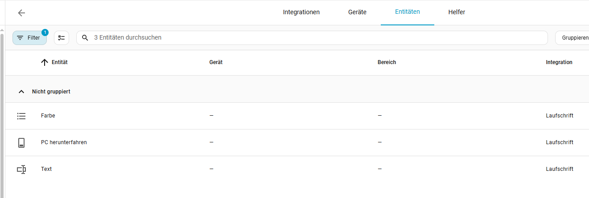
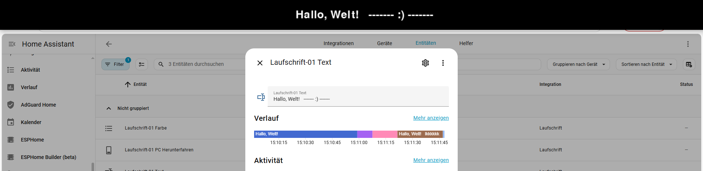
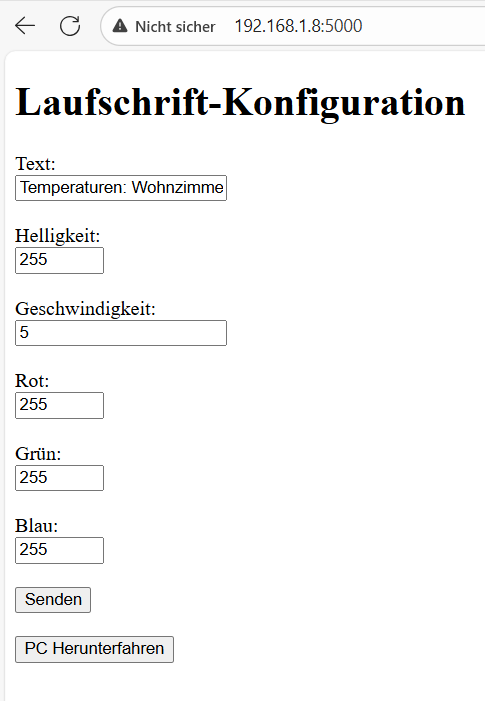
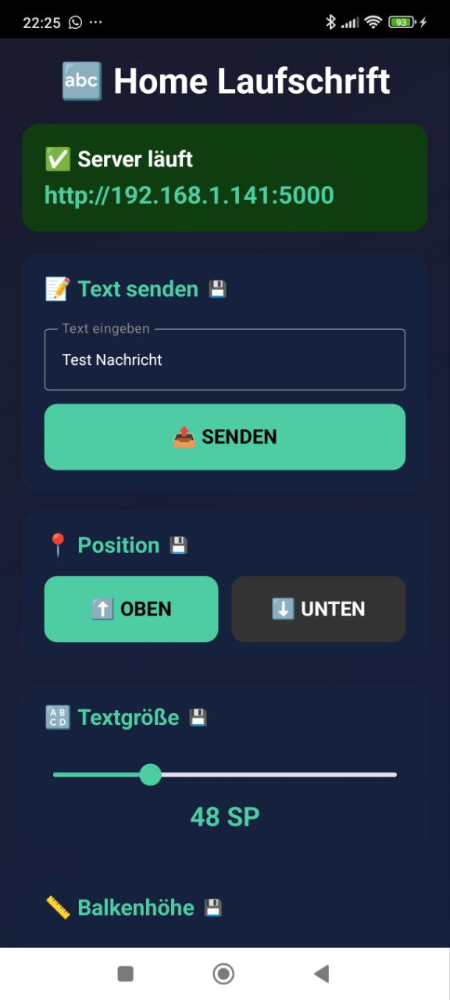
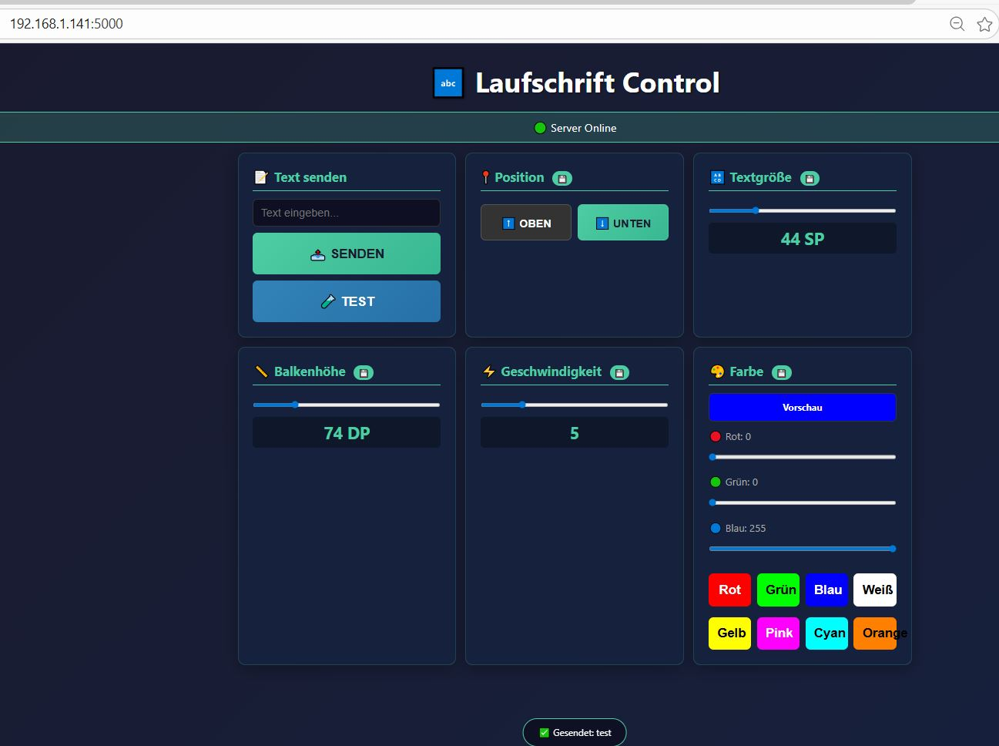

# Home Assistant Laufschrift Integration 📝

🖥️ **Display scrolling text notifications on your TV/PC/Android**

🖥️ **Laufschrift-Benachrichtigungen auf deinem TV/PC/Android anzeigen**

[English](#-english) | [Deutsch](#-deutsch)

---

## ⚠️ Status

| Feature | Status |
|---------|--------|
| 🇩🇪 German UI | ✅ Ready |
| 🇬🇧 English UI | 🚧 Coming soon |
| 🖥️ Windows | ✅ Ready |
| 📱 Android / Android TV | ✅ Ready (NEW!) |
| 🐧 Linux/Mac | 🚧 Coming soon |

---

# 🇬🇧 English

This integration allows you to display scrolling text notifications on any Windows PC, Android device, or TV.

**Perfect for:** Media rooms, living rooms, offices – get notifications without interrupting what you're watching!

---

## 🎯 What does it do?

Send text from Home Assistant to your PC/TV/Android. The text appears briefly as a scrolling banner at the top of the screen, then disappears automatically.

| Feature | Description |
|---------|-------------|
| 📝 **Scrolling Text** | Display any text as notification |
| 🎨 **Custom Colors** | RGB color picker |
| 💡 **Brightness** | Adjustable brightness |
| ⚡ **Speed** | Adjustable scroll speed |
| 🔌 **PC Shutdown** | Shutdown PC remotely via Home Assistant |

---

## ✨ How it works

1. **Software** runs in background (minimized)
2. **Home Assistant** sends text via integration
3. **Text appears** briefly at top of screen
4. **Auto-hides** after text is displayed
5. **Non-intrusive** – doesn't interrupt your movie!

---

## 📸 Screenshots

### Home Assistant Integration


### Entities


### Scrolling Text on Screen


### Web Configuration (Windows)


### Android App



### Web Configuration (Android)


---

## 📋 Requirements

| Platform | Requirements |
|----------|--------------|
| **Windows** | Windows PC |
| **Android** | Android 6.0+ / Android TV |
| **Home Assistant** | 2023.1 or higher + HACS |

---

## 🚀 Installation

### Option 1: Windows PC

1. Download: Laufschrift_exe/laufschrift_app.exe
2. Run on your Windows PC
3. The app minimizes automatically to background
4. Add shortcut to autostart for automatic startup

### Option 2: Android / Android TV (NEW!)

1. Download: laufschrift_app/homelaufschrift.apk
2. Install on your Android device or TV
3. Grant overlay permission when asked
4. App runs as background service

### Home Assistant Integration

1. Add this repository to HACS:
   - Repository: richieam93/homeassistant-laufschrift
   - Category: Integration
2. Install "Laufschrift" via HACS
3. Restart Home Assistant

### Configure

1. Go to **Settings → Integrations**
2. Click **"+ Add Integration"**
3. Search for **"Laufschrift"**
4. Enter device IP address and name

---

## 📱 Android App Features

| Feature | Description |
|---------|-------------|
| 🌐 **Webserver** | Runs on port 5000, accessible from any device |
| 📝 **Overlay** | Scrolls over all apps (even games, homescreen) |
| 📍 **Position** | Top or bottom of screen |
| ⚙️ **Settings** | Text size (20-120 SP), bar height (40-200 DP), speed (1-20), color (RGB + 8 quick colors) |
| 🔄 **Auto-start** | Starts automatically after device reboot |
| 📺 **TV optimized** | Works on Android TV boxes |
| 🔒 **No root needed** | Uses Android Overlay Permission |
| 💾 **Settings saved** | All settings are persisted |

### Android REST API Examples

- Text senden: http://[DEVICE-IP]:5000/text/Hello%20World
- Position ändern: http://[DEVICE-IP]:5000/position/bottom
- Farbe ändern: http://[DEVICE-IP]:5000/red/255
- Geschwindigkeit: http://[DEVICE-IP]:5000/speed/10

### 🎯 Typical Use Case

**Scenario:** TV is running, someone rings the doorbell

1. Home Assistant sends text to app
2. Scrolling text appears over TV picture
3. "🔔 Someone at the door!" scrolls by
4. Disappears automatically

**Perfect for:** Doorbell, washing machine done, warnings, reminders

---

## ⚙️ Entities

After setup, these entities are created:

| Entity | Description |
|--------|-------------|
| text.laufschrift_NAME_text | Set the display text |
| select.laufschrift_NAME_brightness | Set brightness |
| select.laufschrift_NAME_speed | Set scroll speed |
| select.laufschrift_NAME_color | Set text color |
| switch.laufschrift_NAME_pc_herunterfahren | Shutdown PC |

---

## 🤖 Automation Example

See examples folder for automation YAML files.

---

# 🇩🇪 Deutsch

Diese Integration ermöglicht die Anzeige von Laufschrift-Benachrichtigungen auf jedem Windows PC, Android-Gerät oder TV.

**Perfekt für:** Wohnzimmer, Büro, Medienraum – Benachrichtigungen ohne Unterbrechung!

---

## 🎯 Was macht es?

Sende Text von Home Assistant an deinen PC/TV/Android. Der Text erscheint kurz als Laufschrift am oberen Bildschirmrand und verschwindet dann automatisch.

| Feature | Beschreibung |
|---------|--------------|
| 📝 **Laufschrift** | Beliebigen Text anzeigen |
| 🎨 **Farben** | RGB Farbauswahl |
| 💡 **Helligkeit** | Einstellbare Helligkeit |
| ⚡ **Geschwindigkeit** | Einstellbare Laufgeschwindigkeit |
| 🔌 **PC Shutdown** | PC ferngesteuert herunterfahren |

---

## ✨ So funktioniert es

1. **Software** läuft im Hintergrund (minimiert)
2. **Home Assistant** sendet Text über Integration
3. **Text erscheint** kurz am oberen Bildschirmrand
4. **Verschwindet automatisch** nach Anzeige
5. **Nicht störend** – unterbricht keinen Film!

---

## 📸 Screenshots

### Home Assistant Integration


### Entitäten


### Laufschrift auf dem Bildschirm


### Web-Konfiguration (Windows)


### Android App


### Web-Konfiguration (Android)


---

## 📋 Voraussetzungen

| Plattform | Anforderungen |
|-----------|---------------|
| **Windows** | Windows PC |
| **Android** | Android 5.0+ / Android TV |
| **Home Assistant** | 2023.1 oder höher + HACS |

---

## 🚀 Installation

### Option 1: Windows PC

1. Download: Laufschrift_exe/laufschrift_app.exe
2. Auf Windows PC ausführen
3. App minimiert sich automatisch
4. Verknüpfung im Autostart für automatischen Start

### Option 2: Android / Android TV (NEU!)

1. Download: laufschrift_app/homelaufschrift.apk
2. Auf Android-Gerät oder TV installieren
3. Overlay-Berechtigung erteilen wenn gefragt
4. App läuft als Hintergrund-Dienst

### Home Assistant Integration

1. Repository zu HACS hinzufügen:
   - Repository: richieam93/homeassistant-laufschrift
   - Kategorie: Integration
2. "Laufschrift" über HACS installieren
3. Home Assistant neu starten

### Konfigurieren

1. Gehe zu **Einstellungen → Integrationen**
2. Klicke **"+ Integration hinzufügen"**
3. Suche nach **"Laufschrift"**
4. Geräte IP-Adresse und Name eingeben

---

## 📱 Android App Funktionen

| Feature | Beschreibung |
|---------|--------------|
| 🌐 **Webserver** | Läuft auf Port 5000, von jedem Gerät erreichbar |
| 📝 **Overlay** | Scrollt über allen Apps (auch Spiele, Homescreen) |
| 📍 **Position** | Oben oder unten am Bildschirm |
| ⚙️ **Einstellungen** | Textgröße (20-120 SP), Balkenhöhe (40-200 DP), Geschwindigkeit (1-20), Farbe (RGB + 8 Schnellfarben) |
| 🔄 **Auto-Start** | Startet automatisch nach Geräte-Neustart |
| 📺 **TV-optimiert** | Funktioniert auf Android TV Boxen |
| 🔒 **Kein Root nötig** | Nutzt Android Overlay-Berechtigung |
| 💾 **Einstellungen gespeichert** | Alle Einstellungen werden gespeichert |

### Android REST API Beispiele

- Text senden: http://[GERÄTE-IP]:5000/text/Hallo%20Welt
- Position ändern: http://[GERÄTE-IP]:5000/position/bottom
- Farbe ändern: http://[GERÄTE-IP]:5000/red/255
- Geschwindigkeit: http://[GERÄTE-IP]:5000/speed/10

### 🎯 Typische Anwendung

**Szenario:** TV läuft, jemand klingelt an der Tür

1. Home Assistant sendet Text an App
2. Laufschrift erscheint über dem TV-Bild
3. "🔔 Jemand an der Tür!" scrollt vorbei
4. Verschwindet automatisch

**Perfekt für:** Türklingel, Waschmaschine fertig, Warnungen, Erinnerungen

---

## ⚙️ Entitäten

Nach der Einrichtung werden diese Entitäten erstellt:

| Entität | Beschreibung |
|---------|--------------|
| text.laufschrift_NAME_text | Text einstellen |
| select.laufschrift_NAME_brightness | Helligkeit einstellen |
| select.laufschrift_NAME_speed | Geschwindigkeit einstellen |
| select.laufschrift_NAME_color | Farbe einstellen |
| switch.laufschrift_NAME_pc_herunterfahren | PC herunterfahren |

---

## 🤖 Automatisierungs-Beispiel

Siehe examples Ordner für Automatisierungs-YAML Dateien.

---

## ☕ Support this Project / Unterstütze dieses Projekt

This project is **free and open source**. Dieses Projekt ist **gratis und Open Source**.

If it helps you, I'd appreciate a coffee. Wenn es dir hilft, freue ich mich über einen Kaffee:

<a href="https://www.buymeacoffee.com/geartec" target="_blank"></a>

---

## 📝 Feedback & Support

- 🐛 **Issues:** [GitHub Issues](https://github.com/richieam93/homeassistant-laufschrift/issues)
- 💬 **Questions / Fragen:** Just open an issue!

---

## 📜 License / Lizenz

MIT License

---

Made with ❤️ in Switzerland 🇨🇭 | Entwickelt mit ❤️ in der Schweiz 🇨🇭


### Text Automation:

```yaml
automation:
  - alias: "Temperaturen + Tankstelle auf Laufschrift"
    description: "Zeigt stündlich die Temperaturen verschiedener Sensoren auf der Laufschrift an"
    trigger:
      - platform: time_pattern
        minutes: "/50"
    action:
      - service: text.set_value
        data:
          entity_id: text.laufschrift_NAME_text  # Ersetze NAME
          value: >-
            Temperaturen: Wohnzimmer: {{ states('sensor.airpurifier_temperature') }}°C,
            Schlafzimmer: {{ states('sensor.stecker_mucken_device_temperature') }}°C,
            TV Sideboard: {{ states('sensor.stecker_tv_leds_device_temperature') }}°C,
            Caffè Maschine: {{ states('sensor.stecker_kaffe_device_temperature') }}°C,
            Balkon: {{ states('sensor.kresse_temperature') }}°C,
            Tankstelle R. Waser: Diesel: {{ state_attr('sensor.r_waser', 'DIESEL') }} CHF,
            SP95: {{ state_attr('sensor.r_waser', 'SP95') }} CHF
    mode: single

    Helligkeit, Geschwindigkeit und Farbe ändern:
Um die Helligkeit, Geschwindigkeit und Farbe über Automatisierungen oder Skripte zu ändern, verwende den select.select_option Service. Hier sind Beispiele:

Helligkeit ändern:
action:
  - service: select.select_option
    data:
      entity_id: select.laufschrift_NAME_brightness  # Ersetze NAME
      option: "255"  # Wähle eine Helligkeitsstufe aus den verfügbaren Optionen

Geschwindigkeit ändern:
action:
  - service: select.select_option
    data:
      entity_id: select.laufschrift_NAME_speed  # Ersetze NAME
      option: "5"  # Wähle eine Geschwindigkeitsstufe aus den verfügbaren Optionen

Farbe ändern:
action:
  - service: select.select_option
    data:
      entity_id: select.laufschrift_NAME_color  # Ersetze NAME
      option: "Rot"  # Wähle eine Farbe aus den verfügbaren Optionen
