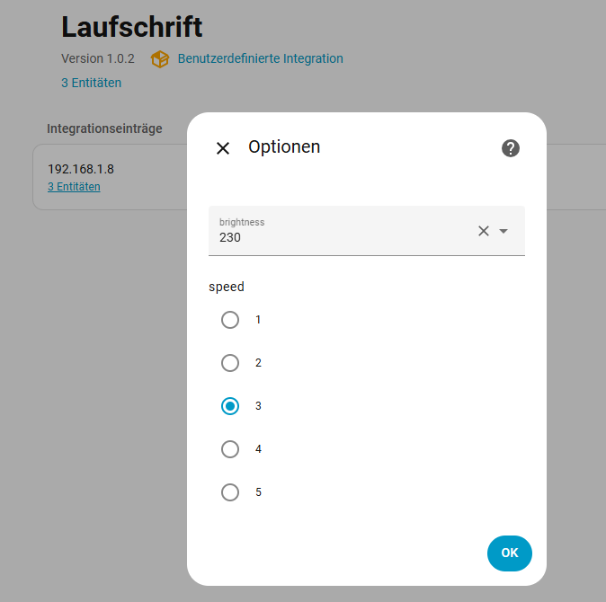
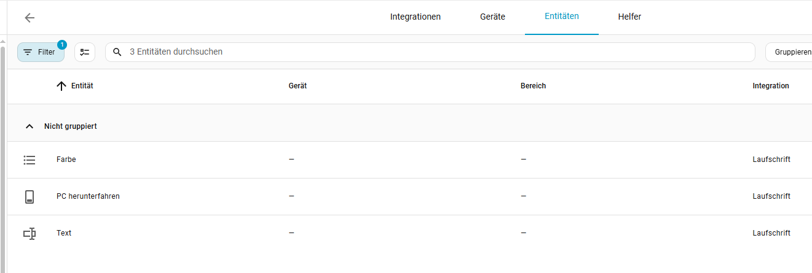
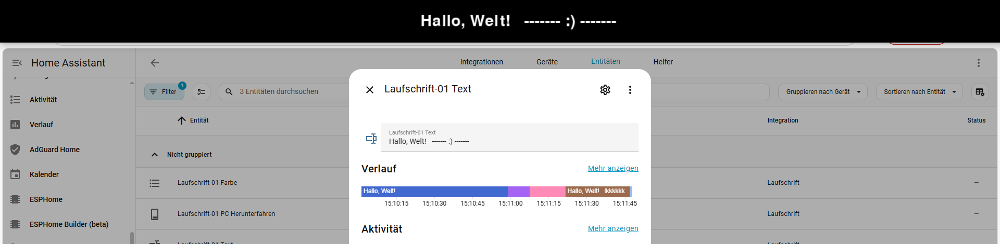
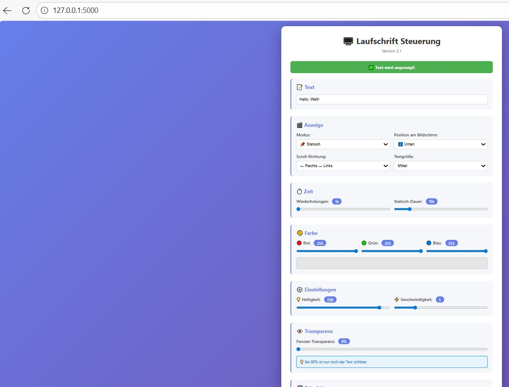
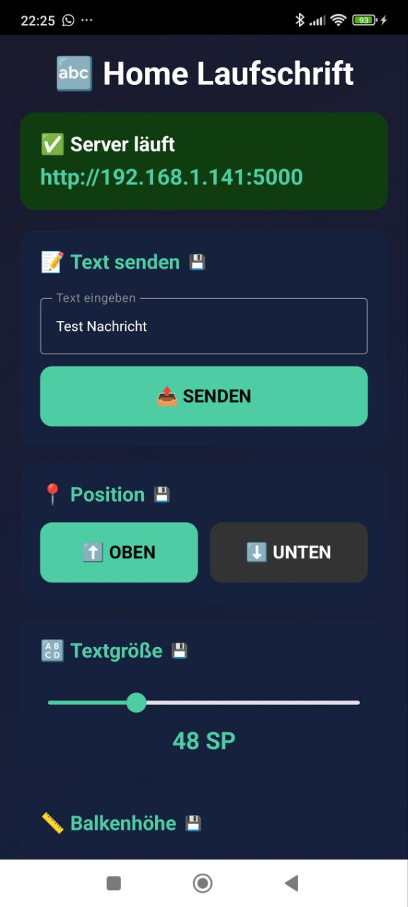
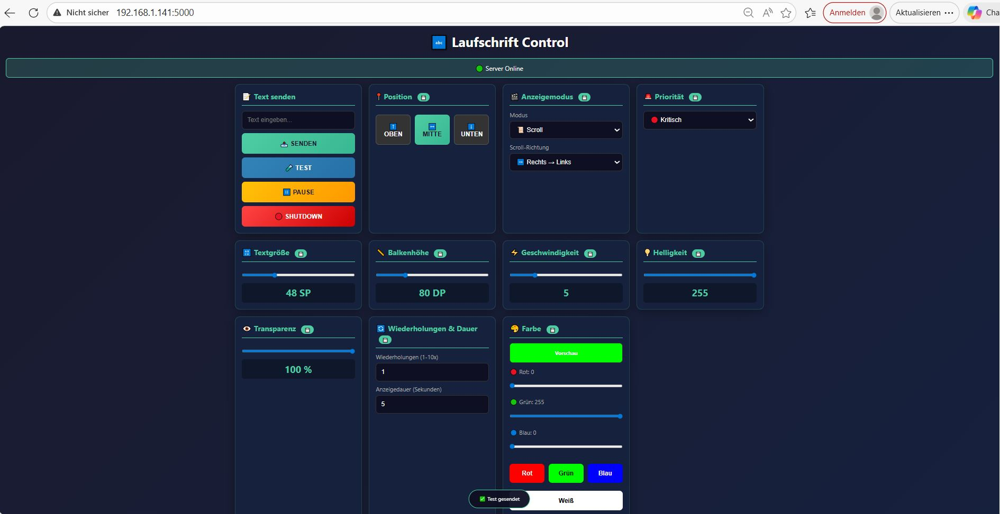

# Home Assistant Laufschrift Integration 📝

🖥️ **Display scrolling text notifications on your TV/PC/Android**

🖥️ **Laufschrift-Benachrichtigungen auf deinem TV/PC/Android anzeigen**

[English](#-english) | [Deutsch](#-deutsch)

## ☕ Support this Project / Unterstütze dieses Projekt

This project is **free and open source**. Dieses Projekt ist **gratis und Open Source**.

If it helps you, I'd appreciate a coffee. Wenn es dir hilft, freue ich mich über einen Kaffee:

---

---

## ⚠️ Status

| Feature | Status |
|---------|--------|
| 🇩🇪 German UI | ✅ Ready |
| 🇬🇧 English UI | ✅ Ready |
| 🖥️ Windows | ✅ Ready (v2.0 - Complete Rewrite!) |
| 📱 Android / Android TV | ✅ Ready (v2.0 - Complete Rewrite!) |
| 🐧 Linux | ✅ Ready Python Skript |

---

# 🇬🇧 English

This integration allows you to display scrolling text notifications on any Windows PC, Android device, or TV.

**Perfect for:** Media rooms, living rooms, offices – get notifications without interrupting what you're watching!

---

## 🎯 What does it do?

Send text from Home Assistant to your PC/TV/Android. The text appears briefly as a scrolling banner at the top of the screen, then disappears automatically.

| Feature | Description |
|---------|-------------|
| 📝 **Scrolling Text** | Display any text as notification |
| 🎨 **Custom Colors** | RGB color picker (Red, Green, Blue, White) |
| 💡 **Brightness** | Adjustable brightness (30-255) |
| ⚡ **Speed** | Adjustable scroll speed (1-10) |
| 🔄 **Display Mode** | Scroll or Static text |
| 📏 **Text Size** | Small, Medium, Large |
| 📍 **Position** | Top, Middle, Bottom |
| ↔️ **Scroll Direction** | Left→Right or Right→Left |
| 🔁 **Repeat** | 1-10 repetitions |
| ⏱️ **Duration** | 1-300 seconds display time |
| 🌫️ **Transparency** | 0-100% background transparency |
| ⚠️ **Priority** | Normal, High, Critical |
| ⏸️ **Pause/Resume** | Pause and resume scrolling |
| 🔌 **PC Shutdown** | Shutdown PC remotely via Home Assistant |

---

## ✨ How it works

1. **Software** runs in background (minimized)
2. **Home Assistant** sends text via integration
3. **Text appears** briefly at configured position
4. **Auto-hides** after text is displayed
5. **Non-intrusive** – doesn't interrupt your movie!

---

## 📸 Screenshots

### Home Assistant Integration

### Entities

### Scrolling Text on Screen

### Web Configuration (Windows)

### Android App

### Web Configuration (Android)

---

## 📋 Requirements

| Platform | Requirements |
|----------|--------------|
| **Windows** | Windows PC |
| **Android** | Android 6.0+ / Android TV |
| **Home Assistant** | 2023.1 or higher + HACS |

---

## 🚀 Installation

### Option 1: Windows PC

1. Download: Laufschrift_exe/laufschrift_app.exe
2. Run on your Windows PC
3. The app minimizes automatically to background
4. Add shortcut to autostart for automatic startup

### Option 2: Android / Android TV

1. Download: laufschrift_app/homelaufschrift.apk
2. Install on your Android device or TV
3. Grant overlay permission when asked
4. App runs as background service

### Home Assistant Integration

1. Add this repository to HACS:
   - Repository: richieam93/homeassistant-laufschrift
   - Category: Integration
2. Install "Laufschrift" via HACS
3. Restart Home Assistant

### Configure

1. Go to **Settings → Integrations**
2. Click **"+ Add Integration"**
3. Search for **"Laufschrift"**
4. Enter device IP address and name

---

## 📱 Android App Features

| Feature | Description |
|---------|-------------|
| 🌐 **Webserver** | Runs on port 5000, accessible from any device |
| 📝 **Overlay** | Scrolls over all apps (even games, homescreen) |
| 📍 **Position** | Top, middle or bottom of screen |
| ⚙️ **Settings** | Text size, bar height, speed, color, transparency |
| 🔄 **Auto-start** | Starts automatically after device reboot |
| 📺 **TV optimized** | Works on Android TV boxes |
| 🔒 **No root needed** | Uses Android Overlay Permission |
| 💾 **Settings saved** | All settings are persisted |

### Android REST API Examples

    Text: http://[DEVICE-IP]:5000/text/Hello%20World
    Position: http://[DEVICE-IP]:5000/position/oben
    Color: http://[DEVICE-IP]:5000/red/255
    Speed: http://[DEVICE-IP]:5000/speed/5
    Mode: http://[DEVICE-IP]:5000/mode/scroll
    Brightness: http://[DEVICE-IP]:5000/brightness/200
    Text Size: http://[DEVICE-IP]:5000/textsize/mittel
    Direction: http://[DEVICE-IP]:5000/direction/ltr
    Repeat: http://[DEVICE-IP]:5000/repeat/3
    Duration: http://[DEVICE-IP]:5000/duration/10
    Transparency: http://[DEVICE-IP]:5000/transparency/50
    Priority: http://[DEVICE-IP]:5000/priority/hoch
    Pause: http://[DEVICE-IP]:5000/pause
    Resume: http://[DEVICE-IP]:5000/resume
    Shutdown: http://[DEVICE-IP]:5000/shutdown

### 🎯 Typical Use Case

**Scenario:** TV is running, someone rings the doorbell

1. Home Assistant sends text to app
2. Scrolling text appears over TV picture
3. "🔔 Someone at the door!" scrolls by
4. Disappears automatically

**Perfect for:** Doorbell, washing machine done, warnings, reminders

---

## ⚙️ Entities

After setup, these entities are created:

### Text Entity
| Entity | Icon | Description |
|--------|------|-------------|
| `text.laufschrift_NAME_text` | mdi:text | Set the display text |

### Switch Entities
| Entity | Icon | Description |
|--------|------|-------------|
| `switch.laufschrift_NAME_shutdown` | mdi:power | Shutdown PC |
| `switch.laufschrift_NAME_pause` | mdi:pause | Pause/Resume scrolling |

### Select Entities
| Entity | Icon | Options |
|--------|------|---------|
| `select.laufschrift_NAME_farbe` | mdi:palette | Rot, Grün, Blau, Weiss |
| `select.laufschrift_NAME_helligkeit` | mdi:brightness-6 | 30, 80, 130, 180, 230, 255 |
| `select.laufschrift_NAME_geschwindigkeit` | mdi:speedometer | 1, 2, 3, 4, 5 |
| `select.laufschrift_NAME_anzeigemodus` | mdi:animation-play | Scroll, Statisch |
| `select.laufschrift_NAME_textgröße` | mdi:format-size | Klein, Mittel, Groß |
| `select.laufschrift_NAME_position` | mdi:format-vertical-align-top | Oben, Mitte, Unten |
| `select.laufschrift_NAME_scroll_richtung` | mdi:arrow-left-right | Links → Rechts, Rechts → Links |
| `select.laufschrift_NAME_priorität` | mdi:priority-high | Normal, Hoch, Kritisch |

### Number Entities (Sliders)
| Entity | Icon | Range |
|--------|------|-------|
| `number.laufschrift_NAME_helligkeit_slider` | mdi:brightness-6 | 0-255 |
| `number.laufschrift_NAME_geschwindigkeit_slider` | mdi:speedometer | 1-10 |
| `number.laufschrift_NAME_wiederholungen` | mdi:repeat | 1-10 |
| `number.laufschrift_NAME_anzeigedauer` | mdi:timer-outline | 1-300 seconds |
| `number.laufschrift_NAME_transparenz` | mdi:opacity | 0-100% |

### Sensor Entities (Read-only)
| Entity | Icon | Description |
|--------|------|-------------|
| `sensor.laufschrift_NAME_aktueller_text` | mdi:text | Current displayed text |
| `sensor.laufschrift_NAME_aktuelle_helligkeit` | mdi:brightness-6 | Current brightness |
| `sensor.laufschrift_NAME_aktuelle_geschwindigkeit` | mdi:speedometer | Current speed |

---

## 🤖 Automation Examples

### Send Text with All Options

    automation:
      - alias: "Doorbell Notification on TV"
        trigger:
          - platform: state
            entity_id: binary_sensor.doorbell
            to: "on"
        action:
          # Set priority first
          - service: select.select_option
            target:
              entity_id: select.laufschrift_NAME_priorität
            data:
              option: "Kritisch"
          # Set color
          - service: select.select_option
            target:
              entity_id: select.laufschrift_NAME_farbe
            data:
              option: "Rot"
          # Set position
          - service: select.select_option
            target:
              entity_id: select.laufschrift_NAME_position
            data:
              option: "Oben"
          # Set repetitions
          - service: number.set_value
            target:
              entity_id: number.laufschrift_NAME_wiederholungen
            data:
              value: 3
          # Send text
          - service: text.set_value
            target:
              entity_id: text.laufschrift_NAME_text
            data:
              value: "🔔 Jemand klingelt an der Tür!"

### Temperature Display Automation

    automation:
      - alias: "Temperaturen auf Laufschrift"
        description: "Zeigt stündlich die Temperaturen verschiedener Sensoren auf der Laufschrift an"
        trigger:
          - platform: time_pattern
            minutes: "/50"
        action:
          - service: select.select_option
            target:
              entity_id: select.laufschrift_NAME_farbe
            data:
              option: "Weiss"
          - service: select.select_option
            target:
              entity_id: select.laufschrift_NAME_anzeigemodus
            data:
              option: "Scroll"
          - service: text.set_value
            target:
              entity_id: text.laufschrift_NAME_text
            data:
              value: >-
                Temperaturen: Wohnzimmer: {{ states('sensor.airpurifier_temperature') }}°C,
                Schlafzimmer: {{ states('sensor.stecker_mucken_device_temperature') }}°C,
                TV Sideboard: {{ states('sensor.stecker_tv_leds_device_temperature') }}°C,
                Caffè Maschine: {{ states('sensor.stecker_kaffe_device_temperature') }}°C,
                Balkon: {{ states('sensor.kresse_temperature') }}°C
        mode: single

### Change Brightness

    action:
      - service: select.select_option
        target:
          entity_id: select.laufschrift_NAME_helligkeit
        data:
          option: "255"

Or with slider:

    action:
      - service: number.set_value
        target:
          entity_id: number.laufschrift_NAME_helligkeit_slider
        data:
          value: 200

### Change Speed

    action:
      - service: select.select_option
        target:
          entity_id: select.laufschrift_NAME_geschwindigkeit
        data:
          option: "5"

Or with slider:

    action:
      - service: number.set_value
        target:
          entity_id: number.laufschrift_NAME_geschwindigkeit_slider
        data:
          value: 7

### Change Color

    action:
      - service: select.select_option
        target:
          entity_id: select.laufschrift_NAME_farbe
        data:
          option: "Rot"

### Change Display Mode

    action:
      - service: select.select_option
        target:
          entity_id: select.laufschrift_NAME_anzeigemodus
        data:
          option: "Statisch"

### Change Position

    action:
      - service: select.select_option
        target:
          entity_id: select.laufschrift_NAME_position
        data:
          option: "Mitte"

### Set Duration and Repeat

    action:
      - service: number.set_value
        target:
          entity_id: number.laufschrift_NAME_anzeigedauer
        data:
          value: 30
      - service: number.set_value
        target:
          entity_id: number.laufschrift_NAME_wiederholungen
        data:
          value: 5

### Set Transparency

    action:
      - service: number.set_value
        target:
          entity_id: number.laufschrift_NAME_transparenz
        data:
          value: 50

### Pause and Resume

    action:
      - service: switch.turn_on
        target:
          entity_id: switch.laufschrift_NAME_pause

    action:
      - service: switch.turn_off
        target:
          entity_id: switch.laufschrift_NAME_pause

### Shutdown PC

    action:
      - service: switch.turn_on
        target:
          entity_id: switch.laufschrift_NAME_shutdown

---

# 🇩🇪 Deutsch

Diese Integration ermöglicht die Anzeige von Laufschrift-Benachrichtigungen auf jedem Windows PC, Android-Gerät oder TV.

**Perfekt für:** Wohnzimmer, Büro, Medienraum – Benachrichtigungen ohne Unterbrechung!

---

## 🎯 Was macht es?

Sende Text von Home Assistant an deinen PC/TV/Android. Der Text erscheint kurz als Laufschrift am Bildschirmrand und verschwindet dann automatisch.

| Feature | Beschreibung |
|---------|--------------|
| 📝 **Laufschrift** | Beliebigen Text anzeigen |
| 🎨 **Farben** | RGB Farbauswahl (Rot, Grün, Blau, Weiss) |
| 💡 **Helligkeit** | Einstellbare Helligkeit (30-255) |
| ⚡ **Geschwindigkeit** | Einstellbare Laufgeschwindigkeit (1-10) |
| 🔄 **Anzeigemodus** | Scroll oder Statisch |
| 📏 **Textgröße** | Klein, Mittel, Groß |
| 📍 **Position** | Oben, Mitte, Unten |
| ↔️ **Scroll-Richtung** | Links→Rechts oder Rechts→Links |
| 🔁 **Wiederholungen** | 1-10 Wiederholungen |
| ⏱️ **Anzeigedauer** | 1-300 Sekunden |
| 🌫️ **Transparenz** | 0-100% Hintergrund-Transparenz |
| ⚠️ **Priorität** | Normal, Hoch, Kritisch |
| ⏸️ **Pause/Fortsetzen** | Laufschrift pausieren und fortsetzen |
| 🔌 **PC Shutdown** | PC ferngesteuert herunterfahren |

---

## ✨ So funktioniert es

1. **Software** läuft im Hintergrund (minimiert)
2. **Home Assistant** sendet Text über Integration
3. **Text erscheint** kurz an konfigurierter Position
4. **Verschwindet automatisch** nach Anzeige
5. **Nicht störend** – unterbricht keinen Film!

---

## 📸 Screenshots

### Home Assistant Integration

### Entitäten

### Laufschrift auf dem Bildschirm

### Web-Konfiguration (Windows)

### Android App

### Web-Konfiguration (Android)

---

## 📋 Voraussetzungen

| Plattform | Anforderungen |
|-----------|---------------|
| **Windows** | Windows PC |
| **Android** | Android 6.0+ / Android TV |
| **Home Assistant** | 2023.1 oder höher + HACS |

---

## 🚀 Installation

### Option 1: Windows PC

1. Download: Laufschrift_exe/laufschrift_app.exe
2. Auf Windows PC ausführen
3. App minimiert sich automatisch
4. Verknüpfung im Autostart für automatischen Start

### Option 2: Android / Android TV

1. Download: laufschrift_app/homelaufschrift.apk
2. Auf Android-Gerät oder TV installieren
3. Overlay-Berechtigung erteilen wenn gefragt
4. App läuft als Hintergrund-Dienst

### Home Assistant Integration

1. Repository zu HACS hinzufügen:
   - Repository: richieam93/homeassistant-laufschrift
   - Kategorie: Integration
2. "Laufschrift" über HACS installieren
3. Home Assistant neu starten

### Konfigurieren

1. Gehe zu **Einstellungen → Integrationen**
2. Klicke **"+ Integration hinzufügen"**
3. Suche nach **"Laufschrift"**
4. Geräte IP-Adresse und Name eingeben

---

## 📱 Android App Funktionen

| Feature | Beschreibung |
|---------|--------------|
| 🌐 **Webserver** | Läuft auf Port 5000, von jedem Gerät erreichbar |
| 📝 **Overlay** | Scrollt über allen Apps (auch Spiele, Homescreen) |
| 📍 **Position** | Oben, Mitte oder Unten am Bildschirm |
| ⚙️ **Einstellungen** | Textgröße, Balkenhöhe, Geschwindigkeit, Farbe, Transparenz |
| 🔄 **Auto-Start** | Startet automatisch nach Geräte-Neustart |
| 📺 **TV-optimiert** | Funktioniert auf Android TV Boxen |
| 🔒 **Kein Root nötig** | Nutzt Android Overlay-Berechtigung |
| 💾 **Einstellungen gespeichert** | Alle Einstellungen werden gespeichert |

### Android REST API Beispiele

    Text: http://[GERÄTE-IP]:5000/text/Hallo%20Welt
    Position: http://[GERÄTE-IP]:5000/position/oben
    Farbe: http://[GERÄTE-IP]:5000/red/255
    Geschwindigkeit: http://[GERÄTE-IP]:5000/speed/5
    Modus: http://[GERÄTE-IP]:5000/mode/scroll
    Helligkeit: http://[GERÄTE-IP]:5000/brightness/200
    Textgröße: http://[GERÄTE-IP]:5000/textsize/mittel
    Richtung: http://[GERÄTE-IP]:5000/direction/ltr
    Wiederholungen: http://[GERÄTE-IP]:5000/repeat/3
    Dauer: http://[GERÄTE-IP]:5000/duration/10
    Transparenz: http://[GERÄTE-IP]:5000/transparency/50
    Priorität: http://[GERÄTE-IP]:5000/priority/hoch
    Pause: http://[GERÄTE-IP]:5000/pause
    Fortsetzen: http://[GERÄTE-IP]:5000/resume
    Shutdown: http://[GERÄTE-IP]:5000/shutdown

### 🎯 Typische Anwendung

**Szenario:** TV läuft, jemand klingelt an der Tür

1. Home Assistant sendet Text an App
2. Laufschrift erscheint über dem TV-Bild
3. "🔔 Jemand an der Tür!" scrollt vorbei
4. Verschwindet automatisch

**Perfekt für:** Türklingel, Waschmaschine fertig, Warnungen, Erinnerungen

---

## ⚙️ Entitäten

Nach der Einrichtung werden diese Entitäten erstellt:

### Text-Entität
| Entität | Icon | Beschreibung |
|---------|------|--------------|
| `text.laufschrift_NAME_text` | mdi:text | Text eingeben |

### Switch-Entitäten
| Entität | Icon | Beschreibung |
|---------|------|--------------|
| `switch.laufschrift_NAME_shutdown` | mdi:power | PC herunterfahren |
| `switch.laufschrift_NAME_pause` | mdi:pause | Pause/Fortsetzen |

### Select-Entitäten
| Entität | Icon | Optionen |
|---------|------|----------|
| `select.laufschrift_NAME_farbe` | mdi:palette | Rot, Grün, Blau, Weiss |
| `select.laufschrift_NAME_helligkeit` | mdi:brightness-6 | 30, 80, 130, 180, 230, 255 |
| `select.laufschrift_NAME_geschwindigkeit` | mdi:speedometer | 1, 2, 3, 4, 5 |
| `select.laufschrift_NAME_anzeigemodus` | mdi:animation-play | Scroll, Statisch |
| `select.laufschrift_NAME_textgröße` | mdi:format-size | Klein, Mittel, Groß |
| `select.laufschrift_NAME_position` | mdi:format-vertical-align-top | Oben, Mitte, Unten |
| `select.laufschrift_NAME_scroll_richtung` | mdi:arrow-left-right | Links → Rechts, Rechts → Links |
| `select.laufschrift_NAME_priorität` | mdi:priority-high | Normal, Hoch, Kritisch |

### Number-Entitäten (Slider)
| Entität | Icon | Bereich |
|---------|------|---------|
| `number.laufschrift_NAME_helligkeit_slider` | mdi:brightness-6 | 0-255 |
| `number.laufschrift_NAME_geschwindigkeit_slider` | mdi:speedometer | 1-10 |
| `number.laufschrift_NAME_wiederholungen` | mdi:repeat | 1-10 |
| `number.laufschrift_NAME_anzeigedauer` | mdi:timer-outline | 1-300 Sekunden |
| `number.laufschrift_NAME_transparenz` | mdi:opacity | 0-100% |

### Sensor-Entitäten (Nur-Lesen)
| Entität | Icon | Beschreibung |
|---------|------|--------------|
| `sensor.laufschrift_NAME_aktueller_text` | mdi:text | Aktuell angezeigter Text |
| `sensor.laufschrift_NAME_aktuelle_helligkeit` | mdi:brightness-6 | Aktuelle Helligkeit |
| `sensor.laufschrift_NAME_aktuelle_geschwindigkeit` | mdi:speedometer | Aktuelle Geschwindigkeit |

---

## 🤖 Automatisierungs-Beispiele

### Text mit allen Optionen senden

    automation:
      - alias: "Türklingel Benachrichtigung auf TV"
        trigger:
          - platform: state
            entity_id: binary_sensor.doorbell
            to: "on"
        action:
          # Priorität setzen
          - service: select.select_option
            target:
              entity_id: select.laufschrift_NAME_priorität
            data:
              option: "Kritisch"
          # Farbe setzen
          - service: select.select_option
            target:
              entity_id: select.laufschrift_NAME_farbe
            data:
              option: "Rot"
          # Position setzen
          - service: select.select_option
            target:
              entity_id: select.laufschrift_NAME_position
            data:
              option: "Oben"
          # Wiederholungen setzen
          - service: number.set_value
            target:
              entity_id: number.laufschrift_NAME_wiederholungen
            data:
              value: 3
          # Text senden
          - service: text.set_value
            target:
              entity_id: text.laufschrift_NAME_text
            data:
              value: "🔔 Jemand klingelt an der Tür!"

### Temperaturen + Tankstelle auf Laufschrift

    automation:
      - alias: "Temperaturen + Tankstelle auf Laufschrift"
        description: "Zeigt stündlich die Temperaturen verschiedener Sensoren auf der Laufschrift an"
        trigger:
          - platform: time_pattern
            minutes: "/50"
        action:
          - service: select.select_option
            target:
              entity_id: select.laufschrift_NAME_farbe
            data:
              option: "Weiss"
          - service: select.select_option
            target:
              entity_id: select.laufschrift_NAME_anzeigemodus
            data:
              option: "Scroll"
          - service: text.set_value
            target:
              entity_id: text.laufschrift_NAME_text
            data:
              value: >-
                Temperaturen: Wohnzimmer: {{ states('sensor.airpurifier_temperature') }}°C,
                Schlafzimmer: {{ states('sensor.stecker_mucken_device_temperature') }}°C,
                TV Sideboard: {{ states('sensor.stecker_tv_leds_device_temperature') }}°C,
                Caffè Maschine: {{ states('sensor.stecker_kaffe_device_temperature') }}°C,
                Balkon: {{ states('sensor.kresse_temperature') }}°C,
                Tankstelle R. Waser: Diesel: {{ state_attr('sensor.r_waser', 'DIESEL') }} CHF,
                SP95: {{ state_attr('sensor.r_waser', 'SP95') }} CHF
        mode: single

### Helligkeit ändern

    action:
      - service: select.select_option
        target:
          entity_id: select.laufschrift_NAME_helligkeit
        data:
          option: "255"

Oder mit Slider:

    action:
      - service: number.set_value
        target:
          entity_id: number.laufschrift_NAME_helligkeit_slider
        data:
          value: 200

### Geschwindigkeit ändern

    action:
      - service: select.select_option
        target:
          entity_id: select.laufschrift_NAME_geschwindigkeit
        data:
          option: "5"

Oder mit Slider:

    action:
      - service: number.set_value
        target:
          entity_id: number.laufschrift_NAME_geschwindigkeit_slider
        data:
          value: 7

### Farbe ändern

    action:
      - service: select.select_option
        target:
          entity_id: select.laufschrift_NAME_farbe
        data:
          option: "Rot"

### Anzeigemodus ändern

    action:
      - service: select.select_option
        target:
          entity_id: select.laufschrift_NAME_anzeigemodus
        data:
          option: "Statisch"

### Position ändern

    action:
      - service: select.select_option
        target:
          entity_id: select.laufschrift_NAME_position
        data:
          option: "Mitte"

### Anzeigedauer und Wiederholungen setzen

    action:
      - service: number.set_value
        target:
          entity_id: number.laufschrift_NAME_anzeigedauer
        data:
          value: 30
      - service: number.set_value
        target:
          entity_id: number.laufschrift_NAME_wiederholungen
        data:
          value: 5

### Transparenz setzen

    action:
      - service: number.set_value
        target:
          entity_id: number.laufschrift_NAME_transparenz
        data:
          value: 50

### Pausieren und Fortsetzen

    action:
      - service: switch.turn_on
        target:
          entity_id: switch.laufschrift_NAME_pause

    action:
      - service: switch.turn_off
        target:
          entity_id: switch.laufschrift_NAME_pause

### PC herunterfahren

    action:
      - service: switch.turn_on
        target:
          entity_id: switch.laufschrift_NAME_shutdown

---

## ☕ Support this Project / Unterstütze dieses Projekt

This project is **free and open source**. Dieses Projekt ist **gratis und Open Source**.

If it helps you, I'd appreciate a coffee. Wenn es dir hilft, freue ich mich über einen Kaffee:

---

## 📝 Feedback & Support

- 🐛 **Issues:** [GitHub Issues](https://github.com/richieam93/homeassistant-laufschrift/issues)
- 💬 **Questions / Fragen:** Just open an issue!

---

## 📜 License / Lizenz

MIT License

---

Made with ❤️ in Switzerland 🇨🇭 | Entwickelt mit ❤️ in der Schweiz 🇨🇭
